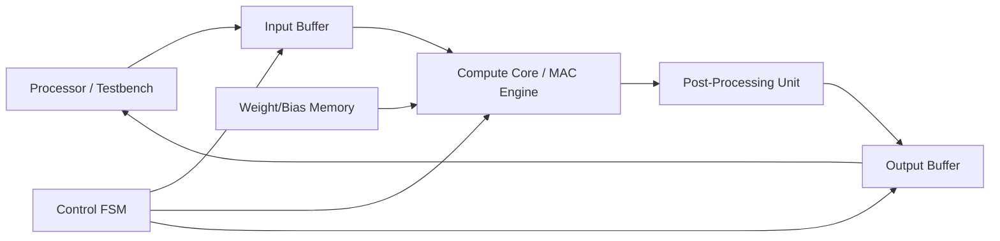

# Architecture Specification

## Overview

This document provides a more detailed description of the system architecture for the fixed-point neural network accelerator.

---

## System Block Diagram

---

## Module Descriptions

### 1. Input Buffer

Stores the input vector `x`.

Responsibilities:
- Accept streamed input data
- Store N elements
- Provide indexed access during computation

---

### 2. Weight/Bias Memory

Stores:
- Weight matrix `W[M][N]`
- Bias vector `b[M]`

Responsibilities:
- Provide weights during MAC operations
- Provide bias after accumulation

Implementation:
- Internal arrays initialized from file or parameters

---

### 3. MAC Engine

Computes inner products:

`sum = sum + (W[i][j] * x[j])`

Responsibilities:
- Signed multiplication
- Accumulation with extended precision
- Signal completion of one output neuron

Design:
- Single multiplier
- Single accumulator
- Two-stage pipelined organization: multiply then accumulate
- Iterative over j

---

### 4. Bias + ReLU Unit

Applies:

`y = max(0, sum + bias)`

Responsibilities:
- Add bias
- Apply ReLU
- Saturate positive overflow to the output maximum
- Truncate result to output width after clamping

---

### 5. Control FSM

Controls execution flow.

States:
- IDLE
- LOAD_INPUT
- COMPUTE_RESET
- COMPUTE_FEED
- COMPUTE_DRAIN
- POST_PROCESS
- WRITE_OUTPUT
- STREAM_OUTPUT
- DONE

Responsibilities:
- Manage indices (i, j)
- Control data movement
- Generate control signals

---

### 6. Output Buffer

Stores output vector `y`.

Responsibilities:
- Store results
- Provide sequential output
- Drive output interface

---

## Dataflow

1. Input loading phase
2. Compute phase (nested loop over i, j)
3. Output phase

---

## Timing Model

The design is sequential:

- Each output neuron requires N MAC operations
- Total cycles ≈ M × N (+ overhead)

This deterministic structure simplifies verification.

---

## Fixed-Point Considerations

- Input width: 16-bit (Q8.8)
- Multiplication produces wider intermediate
- Accumulator width expanded to prevent overflow
- Final result truncated to output width

---

## Design Tradeoffs

### Serial vs Parallel

Chosen: **Serial MAC**

Tradeoffs:
- Lower area
- Simpler control
- Easier debugging
- Higher latency

This is appropriate for the project scope.

---

## Verification-Oriented Design Choices

- Clear separation of datapath and control
- Deterministic sequencing
- Simple interfaces
- Isolated arithmetic blocks

These choices enable effective unit testing and integration testing.

---

## Implementation Status

- `rtl/input_buffer.sv`: implemented with unit test coverage
- `rtl/weight_bias_mem.sv`: implemented with unit test coverage
- `rtl/compute_core.sv`: implemented with unit test coverage
- `rtl/post_processing_unit.sv`: implemented with unit test coverage
- `rtl/controller_fsm.sv`: implemented with unit test coverage
- `rtl/output_buffer.sv`: implemented with unit test coverage
- `rtl/nn_accelerator.sv`: implemented with top-level integration test coverage
