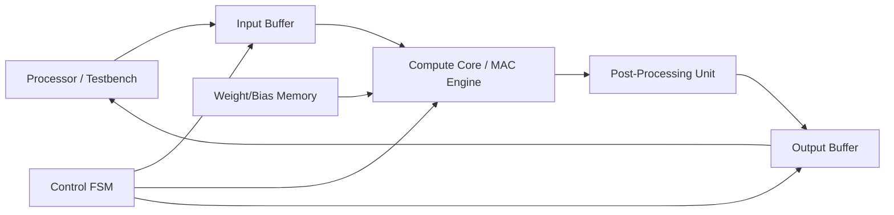

# Architecture Specification

## Overview

This document provides a more detailed description of the system architecture for the fixed-point neural network accelerator.

---

## System Block Diagram

---

## Module Descriptions

### 1. Input Buffer

Stores the input vector `x`.

Responsibilities:
- Accept streamed input data
- Store N elements
- Provide indexed access during computation

---

### 2. Weight/Bias Memory

Stores:
- Weight matrix `W[M][N]`
- Bias vector `b[M]`

Responsibilities:
- Provide weights during MAC operations
- Provide bias after accumulation

Implementation:
- Internal arrays initialized from file or parameters

---

### 3. MAC Engine

Computes inner products:

`sum = sum + (W[i][j] * x[j])`

Responsibilities:
- Signed multiplication
- Accumulation with extended precision
- Signal completion of one output neuron

Design:
- Single multiplier
- Single accumulator
- Two-stage pipelined organization: multiply then accumulate
- Iterative over j

Relevant RTL:
- multiply-stage register and valid tracking: [compute_core.sv](/Users/temirakoenig/Documents/Codex/2026-04-28/github-plugin-github-openai-curated-help-2/fixed-point-nn-accelerator-latest/rtl/compute_core.sv:16)
- accumulator update from the prior-cycle multiply result: [compute_core.sv](/Users/temirakoenig/Documents/Codex/2026-04-28/github-plugin-github-openai-curated-help-2/fixed-point-nn-accelerator-latest/rtl/compute_core.sv:30)

---

### 4. Bias + ReLU Unit

Applies:

`y = max(0, sum + bias)`

Responsibilities:
- Add bias
- Apply ReLU
- Saturate positive overflow to the output maximum
- Truncate result to output width after clamping

---

### 5. Control FSM

Controls execution flow.

States:
- IDLE
- LOAD_INPUT
- COMPUTE_RESET
- COMPUTE_FEED
- COMPUTE_DRAIN
- POST_PROCESS
- WRITE_OUTPUT
- STREAM_OUTPUT
- DONE

Responsibilities:
- Manage indices (i, j)
- Control data movement
- Generate control signals

Relevant RTL:
- state encoding and controller registers: [controller_fsm.sv](/Users/temirakoenig/Documents/Codex/2026-04-28/github-plugin-github-openai-curated-help-2/fixed-point-nn-accelerator-latest/rtl/controller_fsm.sv:30)
- load-input scheduling: [controller_fsm.sv](/Users/temirakoenig/Documents/Codex/2026-04-28/github-plugin-github-openai-curated-help-2/fixed-point-nn-accelerator-latest/rtl/controller_fsm.sv:104)
- compute/reset/drain/post/write sequencing: [controller_fsm.sv](/Users/temirakoenig/Documents/Codex/2026-04-28/github-plugin-github-openai-curated-help-2/fixed-point-nn-accelerator-latest/rtl/controller_fsm.sv:119)
- output streaming and done pulse: [controller_fsm.sv](/Users/temirakoenig/Documents/Codex/2026-04-28/github-plugin-github-openai-curated-help-2/fixed-point-nn-accelerator-latest/rtl/controller_fsm.sv:155)

---

### 6. Output Buffer

Stores output vector `y`.

Responsibilities:
- Store results
- Provide sequential output
- Drive output interface

---

## Dataflow

1. Input loading phase
2. Compute phase (nested loop over i, j)
3. Output phase

---

## Timing Model

The design is sequential:

- Each output neuron requires N MAC operations
- Total cycles ≈ M × N (+ overhead)

This deterministic structure simplifies verification.

For the implemented baseline controller and serial MAC path, the cycle model can be made more explicit:

- input loading takes `N` cycles
- each output neuron takes `1` reset cycle, `N` feed cycles, `1` pipeline-drain cycle, `1` post-process cycle, and `1` writeback cycle
- output streaming takes `M` cycles
- completion adds approximately `1` final cycle

This gives the baseline estimate:

`cycles_per_inference = N + M * (N + 4) + M + 1`

For the currently verified test configuration with `N = 4` and `M = 2`, this evaluates to `23` cycles per inference.

The cycle model follows directly from the implemented controller schedule in [controller_fsm.sv](/Users/temirakoenig/Documents/Codex/2026-04-28/github-plugin-github-openai-curated-help-2/fixed-point-nn-accelerator-latest/rtl/controller_fsm.sv:104) through [controller_fsm.sv](/Users/temirakoenig/Documents/Codex/2026-04-28/github-plugin-github-openai-curated-help-2/fixed-point-nn-accelerator-latest/rtl/controller_fsm.sv:166).

---

## Fixed-Point Considerations

- Input width: 16-bit (Q8.8)
- Multiplication produces wider intermediate
- Accumulator width expanded to prevent overflow
- Final result truncated to output width

---

## Design Tradeoffs

### Serial vs Parallel

Chosen: **Serial MAC**

Tradeoffs:
- Lower area
- Simpler control
- Easier debugging
- Higher latency

This is appropriate for the project scope.

In practical terms, the chosen serial baseline reuses:

- one multiplier instead of `M` parallel multipliers
- one accumulator instead of a bank of parallel accumulators
- simple indexed buffers and parameter memory instead of a wider crossbar-style datapath

The compute core still includes a two-stage pipeline, so the design does not maximize raw throughput, but it does reduce combinational depth relative to an unpipelined multiply-plus-add path.

---

## Verification-Oriented Design Choices

- Clear separation of datapath and control
- Deterministic sequencing
- Simple interfaces
- Isolated arithmetic blocks

These choices enable effective unit testing and integration testing.

---

## Implementation Status

- `rtl/input_buffer.sv`: implemented with unit test coverage
- `rtl/weight_bias_mem.sv`: implemented with unit test coverage
- `rtl/compute_core.sv`: implemented with unit test coverage
- `rtl/post_processing_unit.sv`: implemented with unit test coverage
- `rtl/controller_fsm.sv`: implemented with unit test coverage
- `rtl/output_buffer.sv`: implemented with unit test coverage
- `rtl/nn_accelerator.sv`: implemented with top-level integration test coverage
